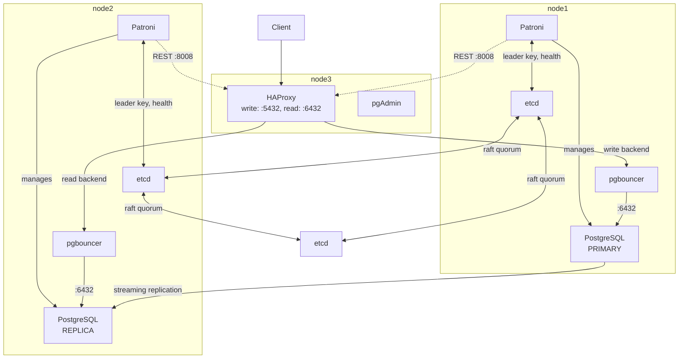

# Patroni + etcd Clustering

A self-managed PostgreSQL high-availability cluster design, built from
Patroni (leader election and lifecycle management), etcd (distributed
configuration store), HAProxy (routing), and pgbouncer (connection
pooling).

This is a 3-node reference design:

- node1, node2: run PostgreSQL under Patroni, plus pgbouncer
- node3: runs HAProxy (routing) and pgAdmin (admin UI)
- All three nodes run etcd, forming the etcd quorum

## Design



How it works:

- Patroni on node1 and node2 each hold a lease on a `leader` key in
  etcd. Whichever one holds the lease is the primary; the other
  follows it as a streaming replica.
- etcd is the source of truth for who's leader. It only accepts writes
  when a quorum (2 of 3) of its nodes agree, which is why etcd also
  runs on node3, a majority can survive one node going down.
- HAProxy on node3 doesn't talk to etcd. It polls each node's Patroni
  REST API (`/primary`, `/replica` on port 8008) to find out who's
  currently primary, and routes the write backend (`:5432`) and read
  backend (`:6432`) accordingly.
- pgbouncer sits in front of PostgreSQL on node1 and node2 (`:6432`),
  pooling connections before HAProxy's backends reach them.
- On failover (the leader's Patroni stops renewing its lease, or the
  node dies), the surviving Patroni on node2 detects the missing
  leader key, promotes its PostgreSQL to primary, and writes the new
  leader key to etcd. HAProxy's next health check picks up the change
  and re-routes traffic within a few seconds.

## Layout

- `manual/`: the original hand-run version, config files and
  setup/test scripts together (`common_conf/`, `node1_conf/`,
  `node2_conf/`, `node3_conf/`, `setup_*.sh`, `test_*.sh`). Read
  these to understand what each step actually does. See
  `manual/README.md`.
- `terraform/`: provisions the EC2 instances, networking, and disks
  this design runs on. See `terraform/README.md`.
- `ansible/`: automates the same install/configure steps as
  `manual/setup_*.sh`, against the same files in `manual/`. See
  `ansible/README.md`.
- `Makefile`: convenience targets that walk through the steps below,
  see `make help`

## Setup order

Three ways to run through this, same order either way: by hand from
`manual/` (see its README), automated with `ansible/`, or guided by
`Makefile`'s `make help` (which opens the right `manual/` script on
the right node over SSH).

1. Base OS (all nodes): base OS packages, Python venv, mount the
   data disk
2. etcd (all nodes): install etcd, init the cluster from node1, join
   node2 and node3
3. PostgreSQL (node1, node2): install PostgreSQL 17 and disable the
   native systemd service (Patroni takes over process management)
4. Patroni (node1, node2): install Patroni, init the cluster from
   node1, join node2
5. pgbouncer (node1, node2): install and configure pgbouncer
6. HAProxy (node3): install and configure HAProxy
7. pgAdmin (node3): install and configure pgAdmin

## Testing the cluster

Check health from any node:

```sh
curl -v '0.0.0.0:8008'
patronictl -c /etc/patroni.yml list
sudo -u postgres psql -h localhost -p 5432 -U postgres -c "SELECT version();"
```

Kill a node's processes and watch it recover:

```sh
pgrep patroni | xargs sudo kill -9
pgrep postgres | xargs sudo kill -9
sudo systemctl status patroni
sudo systemctl status etcd
sudo journalctl -u etcd -u patroni -f
patronictl -c /etc/patroni.yml list
```

Recover a failed node:

```sh
sudo systemctl restart patroni
patronictl -c /etc/patroni.yml reinit <cluster-scope> <node-name>
```

See `manual/test_ha.sh` and `manual/test_etcd.sh` for more failure
scenarios: etcd quorum loss, Patroni crash, full disk, and simulated
network partitions.

## Notes

All hostnames, IPs, and passwords in these configs are placeholders.
Replace `10.0.x.x` addresses and `*.pg.internal` hostnames with real
values for your environment, and never commit real credentials.
